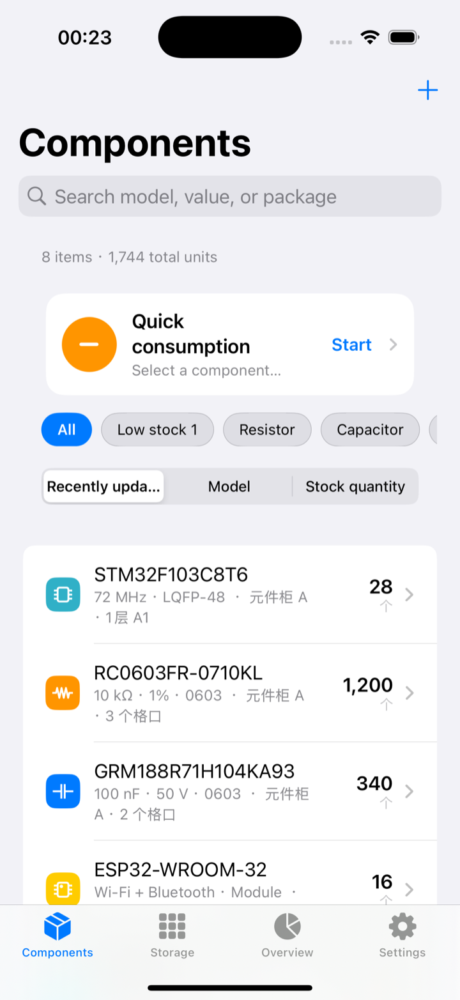
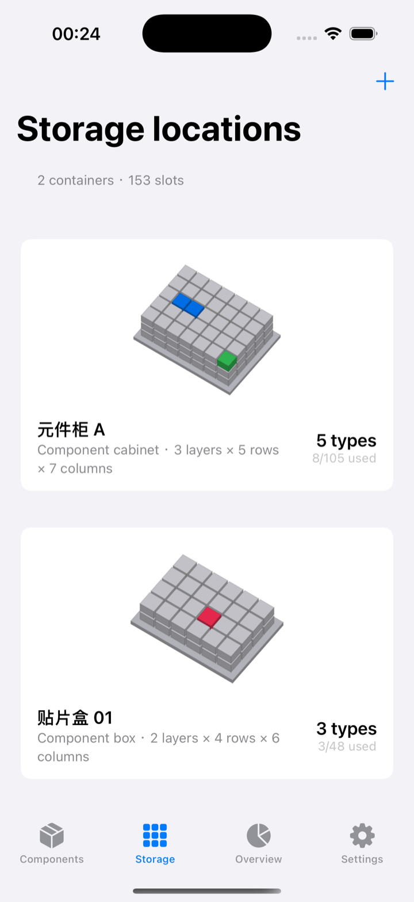
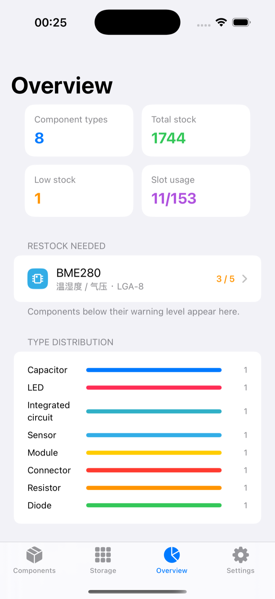
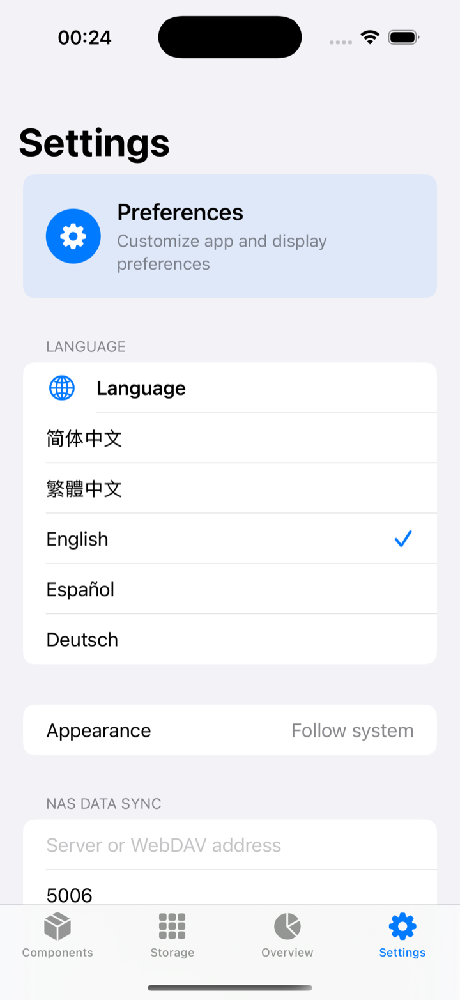

# Arxan ECM

[简体中文](README.md) · [English](README.en.md)

<p align="center">
  
</p>

<p align="center"><strong>A component management app designed for individual electronics enthusiasts.</strong></p>

Arxan ECM helps you organize resistors, capacitors, ICs, modules, and other parts on a personal workbench or in a home lab. Inventory, physical slots, consumption history, and low-stock alerts live in one clear interface, with native apps for Android and iOS.

> [!IMPORTANT]
> This project is a personal-use tool, not an enterprise inventory system. It does not provide multi-user accounts, roles and permissions, approval workflows, purchasing, ERP integration, or multi-user warehouse operations. NAS sync uses one shared personal data library.

## Screenshots

These screens contain sample components so the real workflow is visible at a glance.

<table>
  <tr>
    <td align="center"><br><strong>Components</strong><br>Search, filters, low stock, and quick consumption</td>
    <td align="center"><br><strong>Storage</strong><br>Manage cabinets, boxes, and physical slots</td>
    <td align="center"><br><strong>Overview</strong><br>Stock metrics, restock alerts, and usage history</td>
    <td align="center"><br><strong>Settings</strong><br>Language, appearance, and NAS sync</td>
  </tr>
</table>

For the Chinese interface, see the [Chinese README](README.md).

## Features

- Component records: type, model, value, package, quantity, warning level, unit, and notes.
- Multi-slot storage: assign one component to several slots and locate it in the 3D storage view.
- Quick consumption: a prominent home-screen action records quantity, purpose, or project, while preserving each usage entry.
- Inventory overview: component count, total stock, slot usage, type distribution, low-stock items, and history.
- NAS sync: keeps an offline local copy and synchronizes one personal library through HTTPS WebDAV.
- Five languages: Simplified Chinese, Traditional Chinese, English, Spanish, and German.
- Native apps: Kotlin/Jetpack Compose on Android and Swift/SwiftUI on iOS.

## Typical workflow

1. Create a cabinet or component box under Storage and define its layers, rows, and columns.
2. Add a component under Components and select one or more physical slots.
3. Use Quick consumption on the home screen to record the quantity and purpose.
4. Review low-stock warnings and usage history under Overview.
5. To use the same library across devices, configure your NAS WebDAV connection under Settings.

## NAS sync

Enter the server/WebDAV address, port, administrator username, and password in Settings. The library is stored at `ArxanECM/ecm-data.json` on the NAS while a local offline copy remains on the device.

- Enter the **WebDAV service port**, not the NAS administration-panel port.
- fnOS commonly uses port `5006` for HTTPS WebDAV, but your own NAS configuration is authoritative.
- HTTPS, a trusted certificate, and LAN or trusted-network access are recommended.
- iOS stores the password in Keychain; Android uses EncryptedSharedPreferences.
- Sync is designed for one personal library and does not include account isolation or enterprise-grade conflict resolution.

## Platform requirements

| Platform | Minimum version | Technology |
| --- | --- | --- |
| Android | Android 8.0 / API 26 | Kotlin, Jetpack Compose, Room |
| iOS | iOS 17.0 | Swift, SwiftUI, SQLite |

Both apps are kept aligned in wording, workflow, data structure, and NAS synchronization behavior.

## Build locally

### Android

Requires Android Studio, JDK 17, and Android SDK 34.

```bash
cd "FOR Android"
./gradlew assembleDebug
```

The debug APK is generated at:

```text
FOR Android/app/build/outputs/apk/debug/app-debug.apk
```

### iOS

Requires Xcode 15 or later.

```bash
open "FOR IOS/ECM.xcodeproj"
```

Select the `ECM` scheme and a simulator or connected device in Xcode, then run the app.

## Automated builds

GitHub Actions validates Android and iOS independently. Create a version tag to obtain build artifacts from the corresponding workflow or release.

```bash
git tag v1.0.0
git push origin v1.0.0
```

## Repository layout

```text
.
├── FOR Android/          # Native Android project
├── FOR IOS/              # Native iOS project
├── branding/             # App icon and brand assets
├── docs/images/          # Chinese and English README screenshots
├── README.md             # Chinese documentation
└── README.en.md          # English documentation
```

## Data and privacy

Arxan ECM requires no cloud account. Data stays on the device by default; the app connects only to the WebDAV server you explicitly configure. Back up the NAS data file and protect your credentials.

## Intended use

Arxan ECM is intended for individual electronics enthusiasts, makers, students, and home labs managing their own parts and project consumption. For multi-user permissions, purchasing approvals, auditing, or enterprise warehousing, use a dedicated enterprise inventory platform.
