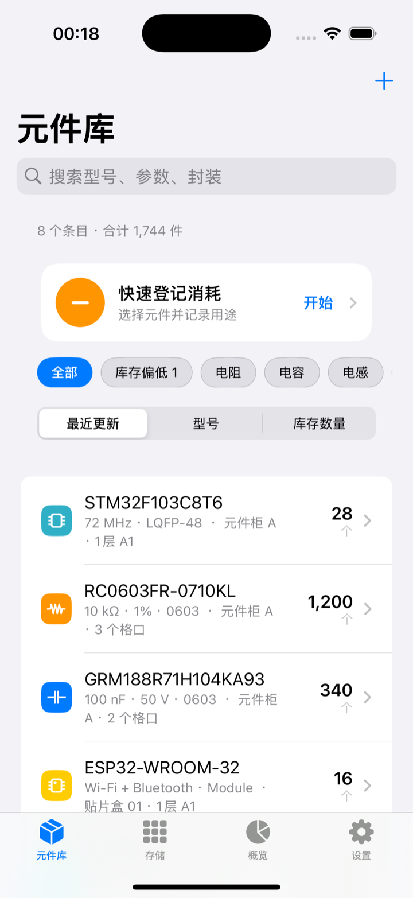
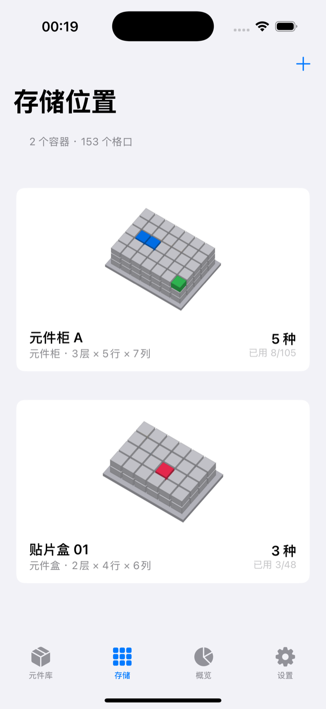
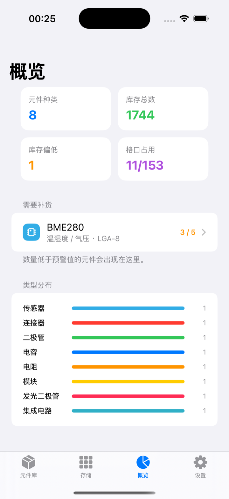
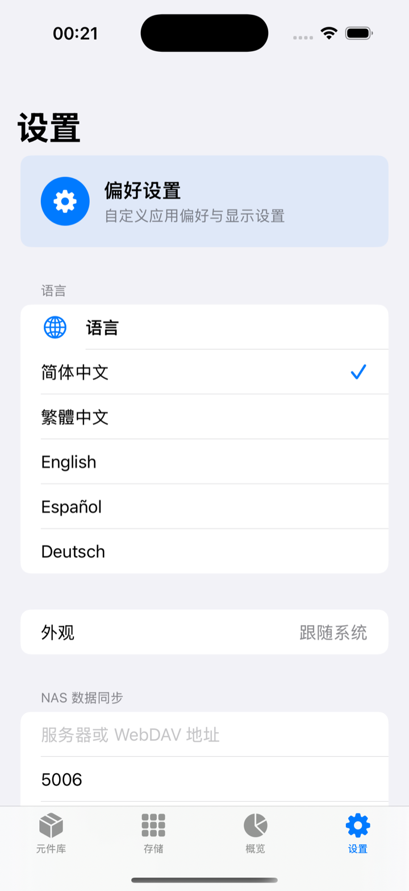

# Arxan ECM

[简体中文](README.md) · [English](README.en.md)

<p align="center">
  
</p>

<p align="center"><strong>专为个人电子爱好者设计的元件管理程序</strong></p>

Arxan ECM 帮你整理个人工作台、家庭实验室里的电阻、电容、芯片、模块和其他电子元件。它把库存、具体格口、消耗记录和低库存提醒放在同一个清晰的界面中，并提供原生 Android 与 iOS 应用。

> [!IMPORTANT]
> 本项目定位为个人自用工具，而不是企业库存系统。它不提供多用户账号、角色权限、审批流、采购、ERP 或多人仓库协作功能；NAS 同步也采用单一资料库模式。

## 界面演示

以下画面使用示例元件制作，便于直接查看实际使用效果。

<table>
  <tr>
    <td align="center"><br><strong>元件库存</strong><br>搜索、筛选、低库存与快速消耗</td>
    <td align="center"><br><strong>存储位置</strong><br>按元件柜和元件盒管理格口</td>
    <td align="center"><br><strong>库存概览</strong><br>库存统计、补货提醒与消耗记录</td>
    <td align="center"><br><strong>应用设置</strong><br>语言、外观与 NAS 同步</td>
  </tr>
</table>

英文界面截图请查看 [English README](README.en.md)。

## 主要功能

- 元件档案：记录类型、型号、参数、封装、数量、最低库存、单位和备注。
- 元件照片：拍照或从相册选择，设备端自动抠图后随元件资料保存。
- 多格口存放：同一种元件可选择多个格口；可按层查看并点选 3D 视图中被遮挡的格口。
- 快速登记消耗：首页醒目入口，记录消耗数量、用途或项目，并保留每次明细。
- 库存概览：汇总元件种类、库存数量、格口使用率、类型分布和低库存项目。
- NAS 同步：保留本地副本，并通过 HTTPS WebDAV 与个人 NAS 的单一资料库同步。
- 五种语言：简体中文、繁體中文、English、Español、Deutsch。
- 双平台原生体验：Android 使用 Kotlin/Jetpack Compose，iOS 使用 Swift/SwiftUI。

## 推荐使用流程

1. 在“存储”中新建元件柜或元件盒，设定层、行、列。
2. 在“元件库”添加元件，并为它选择一个或多个格口。
3. 使用首页“快速登记消耗”填写数量和用途；库存与消耗明细会同步更新。
4. 在“概览”查看低库存提醒和历史记录。
5. 如需跨设备使用，在“设置”中填写 NAS WebDAV 连接信息并同步。

## NAS 同步

设置页需要填写服务器/WebDAV 地址、端口、管理员用户名和密码。数据保存为 NAS 上的 `ArxanECM/ecm-data.json`，手机上仍保留可离线使用的本地副本。

- 请填写 **WebDAV 服务端口**，不是 NAS 管理网页端口。
- fnOS 的 HTTPS WebDAV 常见端口为 `5006`，但应以你自己的 NAS 设置为准。
- 建议使用 HTTPS、可信证书和仅限内网或可信网络的访问方式。
- iOS 密码保存在 Keychain；Android 密码使用 EncryptedSharedPreferences 保存。
- 这是个人单资料库同步，不包含账号隔离和多人冲突处理。

## 平台要求

| 平台 | 最低版本 | 技术 |
| --- | --- | --- |
| Android | Android 8.0 / API 26 | Kotlin、Jetpack Compose、Room |
| iOS | iOS 17.0 | Swift、SwiftUI、SQLite |

两端的界面文案、操作流程、数据结构和 NAS 同步语义保持一致。

## 本地构建

### Android

要求 Android Studio、JDK 17 和 Android SDK 34。

```bash
cd "FOR Android"
./gradlew assembleDebug
```

调试 APK 位于：

```text
FOR Android/app/build/outputs/apk/debug/app-debug.apk
```

### iOS

要求 Xcode 15 或更高版本。

```bash
open "FOR IOS/ECM.xcodeproj"
```

在 Xcode 中选择 `ECM` scheme 和模拟器或已连接设备，然后运行。

## 自动构建

仓库的 GitHub Actions 会分别验证 Android 和 iOS。创建版本标签后，可在对应工作流或 Release 中取得构建产物。

```bash
git tag v1.1.1
git push origin v1.1.1
```

## 项目结构

```text
.
├── FOR Android/          # Android 原生项目
├── FOR IOS/              # iOS 原生项目
├── branding/             # 应用图标与品牌素材
├── docs/images/          # README 中英文演示截图
├── README.md             # 中文说明
└── README.en.md          # English documentation
```

## 数据与隐私

Arxan ECM 不要求注册云端账号。数据默认保存在设备本地；只有在你主动配置 NAS 后，应用才会连接你指定的 WebDAV 服务。请自行备份 NAS 数据文件并妥善保管访问凭据。

## 适用场景

适合个人电子爱好者、创客、学生和家庭实验室，用于整理自己的元件收藏与项目消耗。若需要多人权限、采购审批、审计或企业级仓储，请选择专门的企业库存系统。
